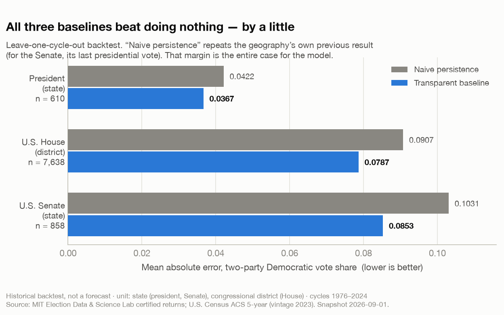
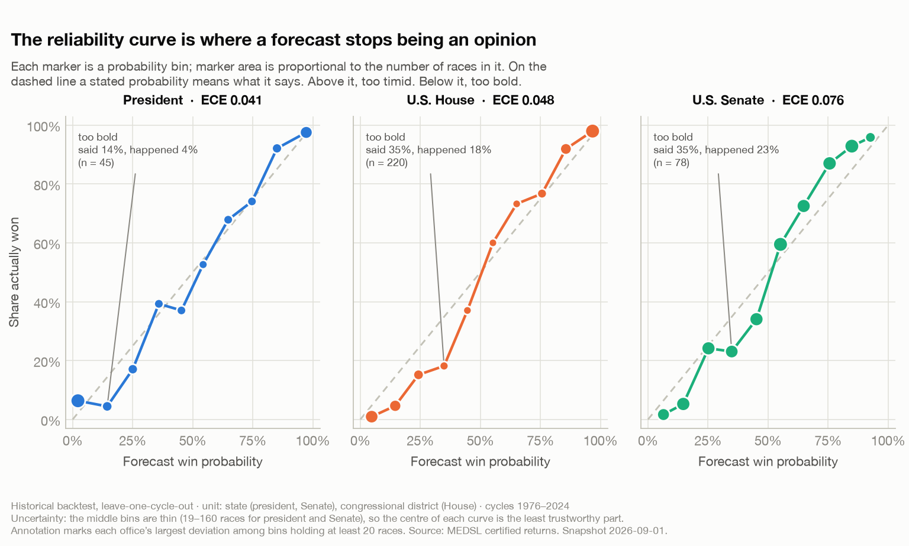
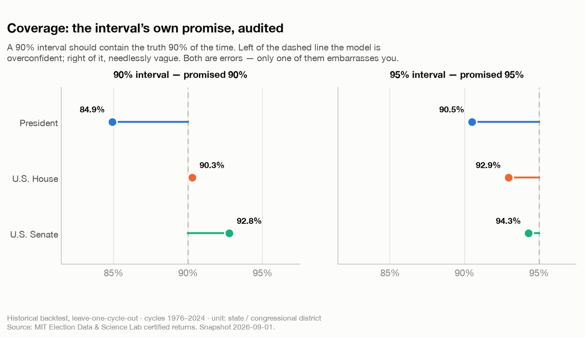

# A Forecast Is a Promise, and Most of Them Are Broken

*How I built three deliberately boring election models, and why the interesting part was auditing whether their probabilities meant anything at all.*

**Savepoint Analytics · US Election Analysis · published from a historical backtest, snapshot 2026-09-01**

---

## The question

I wanted to know whether I could say "this seat is 70% likely to go Democratic" and have that sentence be *true* — not persuasive, not defensible, not vibes-adjacent. True in the specific, checkable sense that if you collect every race where I said 70%, about seven in ten of them went that way.

This is a lower bar than predicting elections and a much higher bar than most published forecasting clears. It is also the only bar I know how to check.

The broader project is a nonpartisan U.S. election forecasting stack: ingest certified returns, build canonical geography, fit transparent baselines, simulate correlated outcomes, evaluate. But the piece I want to talk about is the evaluation, because it is the part that decides whether everything upstream was worth doing. Anyone can produce a number. The question is whether the number is a promise you can keep.

## Why accuracy is not the thing you think it is

Here is the trap. You build a model, you check it against held-out data, it calls 92.9% of House winners correctly, and you feel excellent about yourself.

Then you look at what you were competing against. Across 8,176 House races with a usable prior, an incumbent was running in 79.3% of them, and when an incumbent runs they win 95.6% of the time. Most congressional districts are not close and are not trying to be. Predicting a safe seat correctly is not skill; it is literacy.

This is the same failure that makes a lot of A/B test reporting useless. A test "wins" and everyone celebrates the lift, and nobody asks the two questions that determine whether the number survives contact with reality: *compared to what?* and *how often would this have happened anyway?* A metric without a benchmark is a press release.

So I fixed the benchmark first. For every office, the model has to beat the dumbest thing that could plausibly work:

- **President and House:** repeat the geography's own previous result.
- **Senate:** use the state's most recent presidential vote.

Naive persistence is a genuinely hard opponent in electoral politics, because partisanship is sticky and districts are drawn to stay that way. It is the equivalent of the control arm that already converts well. If you cannot beat it, you have not built a model; you have built an expensive way of re-reading a spreadsheet.

| Office | Unit | Naive MAE | Baseline MAE | Improvement | Winner accuracy | n |
|---|---|---:|---:|---:|---:|---:|
| President | State | 0.0422 | **0.0367** | −13.0% | 87.5% | 610 |
| U.S. House | District | 0.0907 | **0.0787** | −13.3% | 92.9% | 7,638 |
| U.S. Senate | State | 0.1031 | **0.0853** | −17.3% | 80.1% | 858 |

*Two-party Democratic vote share. Leave-one-cycle-out backtest on certified returns, 1976–2024.*

Thirteen to seventeen percent better than doing nothing. That is the entire case for the model, and I want it stated that plainly, because a 13% error reduction is a real result and also nothing like the impression you would form from the 92.9% winner-accuracy figure sitting next to it.

The models themselves are deliberately unglamorous. Ordinary least squares. For the president: the state's lagged two-party share, the national environment, and college-educated share from the ACS. For the House: district lean, national environment, and incumbency. For the Senate: state presidential lean, incumbency, and a midterm-penalty term. No gradient boosting, no neural anything. The rule I work under is that a transparent baseline ships first and has to be beaten before anything clever is allowed near the public output — which means the baseline's job is to be a fair fight, not to win.

## The part that actually matters

Vote-share error tells you whether the model knows where the races are. It tells you nothing about whether its *probabilities* are honest, and those are the numbers people quote.

So the models do not emit probabilities directly. They emit an expected vote share and a residual standard deviation, and win probability is derived by simulation. Separating those two things is the single most useful structural decision in the whole stack, because it makes the question "how confident should I be?" a consequence of measured error rather than a thing I assert.

Then you audit the result with a reliability curve: bin every forecast by its stated probability, and check what fraction of those races actually happened.

Anyone who has played XCOM understands this chart in their bones. You are told the shot is 95%. You take the shot. You miss. You take it again the next turn, and you miss again, and somewhere around the fourth consecutive miss you begin to suspect that the number on the screen and the number in the engine are not on speaking terms. Firaxis famously *did* fudge the displayed odds on lower difficulties, which is either a mercy or a betrayal depending on your temperament. Either way, the lesson generalises: a displayed probability is a claim, and a claim can be checked.

Here is what checking mine turned up.

| Office | Brier ↓ | Log score ↓ | ECE ↓ | 90% coverage | 95% coverage |
|---|---:|---:|---:|---:|---:|
| President | 0.0939 | 0.3179 | 0.0411 | 84.9% | 90.5% |
| U.S. House | 0.0612 | 0.2291 | 0.0482 | 90.3% | 92.9% |
| U.S. Senate | 0.1480 | 0.4599 | 0.0759 | 92.8% | 94.3% |

Brier score and log score are *proper scoring rules*, which is a technical way of saying they cannot be gamed by hedging. Under a proper scoring rule your best strategy is to state your true belief; say 50% on everything and you score badly, say 99% on everything and you score catastrophically the first time you are wrong. Expected calibration error (ECE) is the average gap between what the model said and what happened, weighted by how many races sat in each bin.

All three are roughly calibrated. None is beautiful.

The failure mode is consistent and worth naming: **the models are too bold about long shots.** The presidential model's 10–20% bin contains 45 state-cycles; it said 14% and 4% of them happened. The House model's 30–40% bin holds 220 district-cycles; it said 35% and 18% happened. The Senate's does the same at the same place. Underdogs the model rates as live are deader than it thinks, and — symmetrically — safe seats are safer than it thinks. The curve is S-shaped around the diagonal, which is the signature of a model whose residual variance is slightly too wide in the tails.

That is an honest, fixable, unexciting finding. It is also exactly the kind of thing that never surfaces if you only report accuracy.

## Interval coverage: the promise nobody audits

There is a second promise hiding in any forecast that publishes a range, and almost nobody checks it. If I publish a 90% interval, the truth should fall inside it 90% of the time. Not 85%. Not 97%.

The House is nearly exact (90.3% against a promised 90%). The Senate is a little roomy (92.8%) — its intervals are wider than they need to be, which is the polite failure. The presidential model is the one to watch: 84.9% coverage against a promised 90%. Its intervals are too narrow — 15.1% of state-cycles land outside a range that was supposed to miss 10% of the time.

Both directions are errors. Only one of them gets you quoted in a post-mortem.

## The assumptions doing the heavy lifting

Three, and I would rather state them than have someone find them.

**Leave-one-cycle-out is not a random holdout, and that is on purpose.** If you randomly split election-year data, you leak: 2020 Pennsylvania in training and 2020 Ohio in test are not independent observations, because they share a national environment. Holding out an entire cycle at a time is the electoral version of respecting your randomisation unit. Split by user, not by session; split by cycle, not by race. The same sin, the same fix.

**The House backtest is graded on a curve it did not earn.** The national environment enters that model *contemporaneously* — it knows how the national vote actually broke in the cycle it is predicting. So the 0.0787 MAE measures district-level accuracy *given a correct national call*, which is an advantage no real forecast has. It is a Dr Manhattan assumption: the model is standing outside time, already knowing the thing that is hardest to know. Forecasting the national number is a separate, unsolved problem, and it is the subject of [another post in this series](03-the-parameter-that-wasnt-there.md).

**Uncontested races are excluded from fitting and scoring.** A candidate who runs unopposed tells you about ballot access, not district preference, and letting those rows into the fit would teach the model that some districts are 100–0. They are 5.6% of races. They keep their seats in the seat simulation — carried on a partisanship prior with widened uncertainty — because a chamber simulated on fewer than 435 seats misstates control. Excluded from the fit; never dropped from the count.

## Where reality became inconvenient

The Senate is the loosest model in the stack and I do not fully know why. Brier 0.148, ECE 0.076, winner accuracy 80.1% — visibly worse than the other two on every measure. The honest reading is that statewide races turn on candidate quality, scandal, and recruitment, and I have modelled none of those. Candidate quality is a backlog item, not a feature. Until it exists, the Senate model is a partisanship-and-incumbency machine being asked questions about people.

The second inconvenience is subtler. Look again at the middle of the reliability curves — the region between 30% and 70%, where competitive races live and where a forecast earns its keep. That is where the bins are thinnest: 19 to 160 races depending on office. The part of the curve I care most about is the part I have the least evidence about. Every calibration chart ever published has this problem and almost none of them say so, which is why the marker sizes in my version are scaled by bin count. The fat dots at the ends are where the confidence is; the small ones in the middle are where the story is.

## What the numbers actually say

That a transparent fundamentals baseline, with no polling at all, produces probabilities that are approximately honest across fifty years of certified returns, and beats a naive repeat by 13–17% on vote share.

That is a floor. It is not a forecast, and I have not published one. Everything above is a backtest on elections that already happened, where the answers were available to check. The gap between "calibrated in backtest" and "calibrated on an election that has not occurred" is wide enough to drive a cycle through.

What these numbers do *not* establish: that the model will be calibrated in 2026, that it handles realignment, or that it knows anything about a district whose boundaries have changed since the data it was fit on. That last one turns out to matter enormously, and it is the reason a different post in this series is about a forecast I decided not to publish.

## What I would do differently

- **Fix the tails before the mean.** The S-shape is a variance problem in the extremes, not a bias problem in the centre. A shrinkage term on the residual sigma at the boundaries would probably buy more calibration than any new feature.
- **Add candidate quality.** The Senate model is the one that needs it and the one without it.
- **Report coverage at more than two levels.** Two nominal levels is two data points about a whole distribution. A full coverage curve would show whether the presidential model's narrowness is uniform or concentrated.
- **Stop letting the House model see the national environment.** The number is real but it flatters. A version fit on a *forecast* national environment would be worse and more honest, and the difference between the two is a measurement of how much of the problem I have actually solved.

## The broader lesson

In *The Wire*, the Baltimore police department gets very good at a thing that is not police work. Felonies get reclassified, cases get bounced, the numbers improve, and the improvement is entirely an artefact of how the numbers are made. Nobody in that room is lying. Everybody in that room is juking the stats.

Forecasting has the same disease in a quieter form. Accuracy is the juked stat. It is easy to produce, flattering in every domain where the base rate is lopsided, and almost completely uninformative about whether your probabilities mean anything. Calibration is the stat that cannot be juked, because it is checked against the thing you actually claimed.

The practical version, which applies as much to a growth team's experiment dashboard as to an election model: **any system that outputs probabilities should be audited against the frequencies it implied.** Not the win rate. Not the accuracy. The reliability curve, the coverage, and a proper scoring rule — the three numbers that ask whether the forecast kept its promise.

Mine mostly did. The places where it did not are in the chart above, at full size, with the bin counts attached.

---

*Every figure in this post is generated by [`blog/figures/make_figures.py`](../figures/make_figures.py) from `reports/p1_results.json`, the committed output of the build that produced these models. Data: [MIT Election Data and Science Lab](https://electionlab.mit.edu/) certified federal returns 1976–2024; U.S. Census Bureau American Community Survey 5-year estimates (vintage 2023). Historical backtest only — no live forecast is published. This project is nonpartisan and models probability and uncertainty, not preferred outcomes.*
