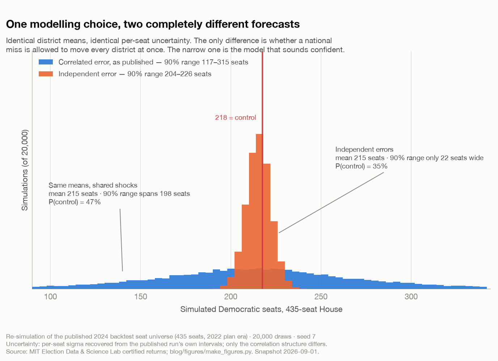

# The Control Rods All Had Graphite Tips

*Two forecasts, identical in every input, that disagree about the House by 176 seats. The difference is one assumption about whether mistakes travel.*

**Savepoint Analytics · US Election Analysis · re-simulation of a historical backtest, snapshot 2026-09-01**

---

## The question

Once you have a model that predicts each race, you still have not answered the question everybody actually asks, which is: *who wins the chamber?*

Four hundred and thirty-five district forecasts do not add up to a House forecast on their own. You have to say something about how their errors relate. And that one modelling choice — buried three layers down, invisible in any summary table, never mentioned in a headline — turns out to dominate everything else in the stack.

I want to show you exactly how much, because I ran it both ways.

## Why independence is so seductive

Suppose each district forecast is a little bit wrong, independently. Some too Democratic, some too Republican, no pattern. Then the errors average out. Four hundred and thirty-five coin flips' worth of noise cancels down to almost nothing, and the seat total becomes very precise very fast.

This is the mathematically convenient assumption, and it is the one your intuition reaches for. It is also spectacularly false about elections, for a simple reason: **polling and fundamentals miss in the same direction at the same time.** 2016 and 2020 were not 50 independent state-level errors. They were one national error, wearing 50 costumes. When a model underestimates one party's support among non-college voters in Wisconsin, it is making the same mistake in Michigan, Pennsylvania, Ohio and Iowa, and for the same reason.

There is a scene in *Chernobyl* that I think about more than is healthy. The RBMK reactor had 211 control rods. Two hundred and eleven independent safety devices, which is a very comforting number — until you learn they all had graphite tips, and that under the right conditions inserting them *increased* reactivity before reducing it. They were never 211 safety devices. They were one safety device with a shared design flaw, deployed 211 times. The redundancy was cosmetic, because the failure mode was common-cause.

An independent-error election model is 435 control rods with graphite tips. It looks robust. Its robustness is an artefact of pretending the failure mode is local.

## How the model handles it

Every simulated election draws three error components, and each district's error is a weighted sum of all three:

```
err_i = √a_nat · z_nat  +  √a_reg · z_reg[region(i)]  +  √a_state · z_i
```

with `a_nat + a_reg + a_state = 1`, scaled by each district's own residual sigma. `z_nat` is drawn once per simulated election and applies to every district. `z_reg` is drawn once per Census region. Only `z_i` is idiosyncratic.

The arithmetic consequence is the whole point. Because the variance shares sum to one, **each district's own uncertainty is unchanged** — the marginal interval on any single seat is identical under either structure. What changes is the *joint* distribution. Two districts in different regions now correlate at 0.45; two in the same region at 0.70.

So I ran the published 435-seat simulation twice. Same district means, same per-seat sigmas, same seed, 20,000 draws each. The only difference is the variance split: `(0.45, 0.25, 0.30)` against `(0, 0, 1.0)`.



| Error structure | Mean Dem seats | 90% range | Width | P(Dem control) |
|---|---:|---:|---:|---:|
| Correlated (as published) | 214.6 | 117–315 | **198 seats** | **47.0%** |
| Independent | 214.9 | 204–226 | **22 seats** | **35.0%** |

The means are the same to within a third of a seat, as they must be. The 90% range is **nine times wider** under correlation. And the control probability moves by twelve points in a direction that is not obvious until you look at the picture.

That last part is the bit I find genuinely instructive. The independent model is not merely overconfident in the abstract; it is confidently wrong in a *specific* way. Its distribution is a narrow spike centred at 215, three seats short of the 218 needed for control. So it concludes, with great precision, that Democrats fall just short — 35% and tidy. The correlated model has the same central estimate but knows that a single national miss of a couple of points drags the whole chamber with it, so a 214-seat mean and a genuine coin flip are perfectly compatible. Forty-seven percent.

Precision purchased by a false assumption does not just add error bars in the wrong place. It relocates the answer.

## The same mistake, in a different building

If you have ever run an online experiment, you have met this exact bug wearing different clothes.

You randomise at the *session* level but your metric is per-user, and users have multiple sessions. Or you randomise users but the treatment leaks between them — a marketplace, a social feed, anything with network effects. Or you run a geo test and treat 50 metros as 50 independent observations when they share a national ad campaign, a holiday calendar, and a weather system.

In every case the machinery is identical to the one above. Observations share a component. The design effect on a cluster mean is roughly

```
deff = 1 + (m − 1) · ICC
```

so a modest intra-cluster correlation over a large cluster inflates the true variance enormously. With 435 districts sharing a national component at ρ ≈ 0.45, the naive standard error on an aggregate understates reality by better than an order of magnitude, and your effective sample size collapses from 435 to something you can count on one hand. My seat distributions came out 9× wider; that is the same phenomenon, filtered through the nonlinearity of a seat threshold rather than a clean average.

The practical symptom is always the same, and it is always misdiagnosed: **your experiments keep reaching significance and your wins keep failing to show up in the quarterly numbers.** That is not a measurement problem downstream. That is a variance structure you declared away upstream.

Elections have the advantage of being a domain where everyone already knows the correlation is there — 2016 made it unignorable. Product analytics mostly does not have that shared trauma yet, which is why the graphite-tipped control rod remains a load-bearing component of so many dashboards.

## The assumption doing the heavy lifting, and it is a big one

Here is where I have to be straight with you.

**The 45/25/30 split is asserted, not estimated.** I chose it. It is a defensible choice — it puts most of the shared variance at the national level, where the historical evidence says polling and fundamentals misses actually live, and gives regions a secondary role — but it is not fitted to anything, and the seat distribution is extremely sensitive to it. Every number in the chart above inherits that choice.

What I can defend is the *direction*: any positive national share is closer to the truth than zero, and the failure from underestimating correlation is far more expensive than the failure from overestimating it. An overly wide chamber forecast is embarrassing. An overly narrow one is the 2016 genre of wrong.

What I cannot yet defend is the magnitude. That is a measurable quantity — the cycle-level component of historical residuals is sitting right there in fifty years of certified returns — and I have not measured it. Calling it a parameter would be false precision; calling it an assumption and printing it is the most I am entitled to.

The second assumption worth flagging: **regions are Census regions.** That is a bureaucratic geography, not a political one. The real correlation structure is demographic — a polling miss among non-college voters travels along education lines, not along the Mason–Dixon line. Census regions are a crude proxy that I picked because the geography spine already had them. A demographic similarity matrix would be better and is harder.

## Where reality became inconvenient

Forty-four of the 435 seats have no fitted model at all. They are districts that ran uncontested or whose returns failed vote-total reconciliation, and they are carried on a partisanship prior with roughly double the uncertainty — sigma 0.223 against 0.113 for modelled seats.

The temptation is to drop them. Resist it. A chamber simulated on 391 seats does not have 91% of the uncertainty of a 435-seat chamber; it has a *different chamber*, and its control probability is meaningless. Incomplete universes are how you produce a forecast of a legislature that does not exist. So the fallback seats stay in, carrying honest, wider uncertainty, and the coverage table in every report states how many seats came from where.

The other inconvenience is that I cannot validate this choice as cleanly as I would like. Calibrating a *chamber-level* probability requires chamber-level outcomes, and there have been about 25 House elections in the modelled era. Twenty-five observations is not a calibration set; it is an anecdote with a standard error. District-level calibration I can check against 7,662 district-cycles. Chamber-level calibration is, for now, an argument from structure rather than a measurement.

## What I would change

- **Estimate the variance shares.** Decompose historical residuals into cycle, region and district components and fit the split instead of asserting it. This is the single highest-value fix in this post and I have no excuse for it other than sequencing.
- **Replace Census regions with demographic neighbourhoods.** Correlation should follow education, urbanicity and race composition, not administrative boundaries.
- **Let correlation vary by office.** Presidential error is probably more nationally correlated than House error, which has more local idiosyncrasy. One split for all three offices is a simplification I have not tested.
- **Stress-test against the 2016 and 2020 misses directly.** If the correlated structure is right, those cycles should sit inside its intervals. That is a check I can run and have not.

## The broader lesson

In *The Expanse*, nobody gets to move one rock. Every burn changes an orbit, every orbit intersects another, and the whole Belt is a single mechanical system whose parts cannot be reasoned about separately. Characters who forget this die, usually of something that looked local at the time.

Correlated error is the same fact about inference. The question is never "how uncertain is this one estimate" — it is "what else is wrong at the same time, and for the same reason." A model that answers the first question and skips the second will always sound more confident than a model that answers both, and it will always be the one that fails when the failure matters.

The good news is that this is not a hard fix. It is one variance decomposition and an honest note about where the numbers came from. The hard part is noticing that 211 safety devices might be one safety device wearing a costume.

---

*Figure generated by [`blog/figures/make_figures.py`](../figures/make_figures.py), re-simulating the published 435-seat House universe from `reports/p1_results.json` with 20,000 draws under two correlation structures. Per-seat sigma is recovered from that run's own published intervals, which reproduces its two documented regimes (0.113 for modelled seats, 0.223 for widened-prior seats); seats whose intervals hit a 0/1 bound are assigned the modelled sigma. The correlated re-simulation gives P(control) = 47.0% against the published run's 47.4% — the gap is draw count and sigma recovery, not a different model. Data: [MIT Election Data and Science Lab](https://electionlab.mit.edu/) certified federal returns 1976–2024. Historical backtest only — no live forecast is published.*
