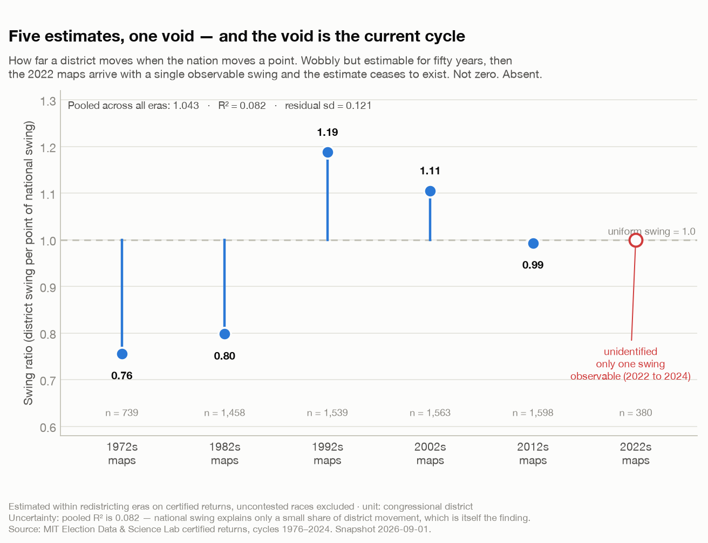

# The Parameter That Wasn't There

*I had eight data points, a question that needed a ninth, and a function signature that wanted a default value. This is about why I deleted the default.*

**Savepoint Analytics · US Election Analysis · modelled projection, not published as a forecast · snapshot 2026-09-15**

---

## The question

Every district-level forecast in my stack sits on top of one national number: how the country as a whole is leaning this cycle. Get that wrong and 435 individually reasonable district forecasts are 435 individually wrong district forecasts, all in the same direction, for the same reason.

The usual way to measure it is a generic-ballot poll average. I do not have one. Not because the polls do not exist, but because I have not resolved whether this project may store and redistribute pollster toplines, and until someone writes that answer down with the terms cited, no poll data enters the repository. That is a governance decision, not a modelling one, and it is blocking.

So the question became: what can you say about the national environment using only things you are allowed to have?

## The signal I actually had

Special elections. When a seat comes open mid-cycle, a real electorate votes in a real contest, and you can compare the result to that district's presidential baseline. The gap — *overperformance* — is the closest thing to a live reading of the national mood that requires no licensed data at all.

I hand-compiled eight of them, running from April 2025 to June 2026. Every row carries a source URL and a retrieval date; the schema rejects any row that does not. The result:

> **Mean overperformance +18.77 points of margin (standard error 2.20), n = 8.**

That is a large number, and the standard error is small, and if I stopped typing here you would form a very confident impression of the 2026 midterms.

Please do not. That standard error is one of the more misleading numbers I have ever computed, and I want to explain exactly why before I show you what I did with it.

## Why the signal is not the thing it resembles

In *Alien: Isolation*, the motion tracker is the most useful object in the game and it will get you killed. It tells you something is moving nearby. It does not tell you where, or what, or whether the thing it is reading is the Alien or a working joe or an air duct. Players die because they treat a bearing as a position.

Special-election overperformance is a motion tracker. It says the environment has moved. It does not say by how much it will have moved *in a general election*, and the reasons are structural rather than statistical:

- **Specials are not a random sample of seats.** They happen where a vacancy happened — a death, a resignation, an appointment. The seat selects itself, and not for reasons orthogonal to politics.
- **The electorate is not the same electorate.** A February special in a single district draws the people who show up for a February special in a single district: high-engagement, high-information, disproportionately the out-party's most motivated voters. This biases the raw mean upward, and I know the direction of that bias without knowing its size.
- **Margin controls for turnout level, not turnout composition.** Using margin rather than raw votes handles the fact that fewer people vote. It does nothing about *which* people.
- **It is an association, not a measurement.** Overperformance correlates with the eventual national environment. It is not a noisy reading of it.

So the honest model is: general-election swing = special-election swing × *some shrinkage factor between 0 and 1*.

And now the actual problem arrives. What is the shrinkage factor?

## The thing you cannot estimate

You would estimate it from history. Compile special elections from past cycles, compare each cycle's specials to the general that followed, and fit the ratio. There are four usable cycle pairs in the modern era. That work is specified and not yet done.

But here is the deeper version of the problem, and it is the part I find genuinely interesting, because it is a lesson about the difference between *sample size* and *identification*.

My House model translates a national swing into district swings through a swing ratio — how far a district moves when the nation moves a point. That ratio has to be estimated within a redistricting era, because district boundaries changing breaks the comparison. Here is what fifty years of certified returns give you:

| Plan era | Swing ratio | Residual sd | R² | n (district-cycles) |
|---|---:|---:|---:|---:|
| 1972 maps | 0.756 | 0.128 | 0.007 | 739 |
| 1982 maps | 0.798 | 0.128 | 0.032 | 1,458 |
| 1992 maps | 1.188 | 0.119 | 0.070 | 1,539 |
| 2002 maps | 1.105 | 0.125 | 0.171 | 1,563 |
| 2012 maps | 0.993 | 0.111 | 0.069 | 1,598 |
| **2022 maps** | **unidentified** | — | — | **380** |
| Pooled | 1.043 | 0.121 | 0.082 | 7,277 |

Three hundred and eighty district-cycles in the current era. A perfectly respectable number of rows. And zero information about the parameter, because a swing ratio is a *slope* — it needs at least two national swings to have a direction, and the 2022 maps have so far produced exactly one observable swing, from 2022 to 2024. One point does not have a slope. You cannot regress your way out of it, you cannot bootstrap your way out of it, and you certainly cannot average your way out of it.

This is the distinction that bites people in experimentation constantly. You have 380 rows so you assume you have 380 rows' worth of evidence. You do not. You have one cluster, sampled 380 times. The rows tell you a great deal about *within-era variation* and nothing whatsoever about the quantity you actually asked for. Sample size measures how much data you collected. Identification asks whether the data you collected can, even in principle, answer the question. They are not the same thing and one does not fix the other.

The *3 Body Problem* version: the Trisolarans build a computer out of thirty million soldiers to predict their own suns, and it does not work, because the system is not under-computed — it is chaotic. More soldiers is not the answer. More rows is not the answer either, when the structure is the problem.

And in *Mindhunter*, Bill Tench spends two seasons asking a version of the same question: we have eight interviews, so what exactly do we think we know? The answer is *something*, and the something is real, and it is not a coefficient.

## What I built instead

Here is the engineering decision I am most pleased with in this whole project, and it is four lines long.

The national-environment estimator returns a structured object carrying `identified`, `assumptions`, `provenance`, and — when it is not identified — a **band** instead of a point. A validator refuses to let a specials-derived estimate claim `identified = True`. And the `shrinkage` argument has **no default value**. It is a required keyword. You cannot call this function without stating, in the call site, what you are assuming.

That last one matters more than it sounds. The original code had `SHRINKAGE_UNCALIBRATED = 0.5` sitting in a module constant. It was documented as a placeholder. It would have been used as a parameter within a month, by me, and then it would have appeared in a chart, and by the time anyone asked where 0.5 came from the answer would have been "it's what the model uses."

A default value on an unidentified parameter is a laundering mechanism. It takes an assumption in and emits a result that looks estimated. Deleting it converts a silent choice into a compile-time question.

So the output is a sweep. Here is the whole thing:

| Assumed shrinkage | National Dem share | House mean seats | House 90% range | P(Dem House) | P(Dem Senate) |
|---:|---:|---:|---:|---:|---:|
| 0.25 | 51.6% | 224.2 | 146–318 | 51.8% | 27.2% |
| 0.33 | 52.3% | 228.3 | 151–325 | 55.1% | 29.8% |
| 0.50 | 53.9% | 237.0 | 161–338 | 61.9% | 35.7% |
| 0.75 | 56.3% | 250.4 | 175–357 | 71.2% | 45.0% |
| 1.00 | 58.6% | 264.4 | 187–373 | 79.2% | 54.5% |

*Margin swing is halved to convert to a share, so a shrinkage of 1.0 applies the full +18.77-point specials margin to the 2024 House baseline of 49.2%.*

## What the band actually says

Two things, and only two.

**On the House, the band has a verdict.** Democrats are favoured at every assumption in it — P(control) runs from 51.8% to 79.2%, and never crosses 0.5. That conclusion is robust to the thing I do not know. It is also much weaker than any individual number in that column sounds: "somewhere between a coin flip and a strong favourite" is the honest translation.

**On the Senate, the band has no verdict, and that is the finding.** P(Democratic control) runs from 27.2% to 54.5%, straddling the coin flip. The chamber's outcome depends entirely on a parameter I cannot estimate. There is no responsible way to collapse that into a headline, and the report says so in text rather than leaving a reader to work it out from a table.

Notice what publishing a single number would have done here. Pick 0.5 — the innocuous middle, the default I deleted — and you get "Democrats 62% to take the House, 36% to take the Senate." Two clean figures, quotable, apparently precise. Both of them are the assumption talking. The Senate one is not even directionally stable.

I have read a great many forecasts that were, structurally, that number. Usually the assumption is not in the article.

## The assumptions doing the heavy lifting

- **The band's endpoints are also a choice.** I swept 0.25 to 1.0. Why not 0.1? Because a shrinkage near zero would say specials carry essentially no information about generals, which the historical record contradicts. But the lower bound is a judgement, and a wider sweep would widen the House conclusion too.
- **The standard errors in that table cover sampling across the eight specials only.** They do not include shrinkage uncertainty, which is much larger. Do not read them as forecast intervals; they are the smallest of the several uncertainties in play.
- **Specials are measured against presidential baselines and applied to a House basis.** Those are different electorates voting for different offices. The conversion is a simplification.
- **Eight is eight.** No amount of careful methodology upstream changes the fact that this estimate rests on eight hand-compiled contests, each with a source URL I can show you and none of which were chosen by me.

## What I would change

- **Build the historical calibration pairs.** Four cycle pairs — 2017→18, 2019→20, 2021→22, 2023→24 — compiled to the same schema and run through the same overperformance code path. That does not produce an *estimate* of shrinkage; it produces a defensible *interval* for it, which is enough to narrow the band and possibly resolve the Senate. This is the highest-value open item in the project.
- **Resolve the poll redistribution question.** A backtested generic-ballot average would demote specials from primary estimator to cross-check — reported alongside, never blended, with disagreement between them stated rather than averaged away. Two estimators that disagree are information. An average of them is a way of hiding it.
- **Add an economic-fundamentals estimator, with a rule about time.** Election-year growth predicts the incumbent party's national share, and the specification for this is pre-registered: one growth term, `president_on_ballot`, `consecutive_terms`, targeting the incumbent party rather than a fixed party. The pre-registration is the point — writing the specification down before seeing the backtest is what stops the search for a model that agrees with you.

  It also comes with an unusual constraint. Every row carries the *data vintage*: the value as it was known at the time, not as later revised. Backtesting an economic model on revised figures is *Outlander* forecasting — going back in time with knowledge nobody in the room could have had, and then being impressed with how well you did. The 1992 election is the standing lesson here: income and output told different stories, and the one that mattered to voters was not the one that looked best in retrospect.

## The broader lesson

There is an enormous difference between "the effect is zero" and "this design cannot see the effect," and almost every institution that produces numbers is built to convert the second into the first. A pipeline wants a float. A dashboard wants a cell. A slide wants a bullet. At every stage, "unidentified" is the least survivable value a variable can hold, so it quietly becomes a default, and the default becomes a finding.

The fix is not statistical sophistication. It is a type signature. Make the absence of knowledge a thing the system can represent and refuse to silently resolve — a required argument, a `status = "band"`, a validator that raises — and the epistemics take care of themselves, because the code will no longer let you skip the question.

Eight special elections told me the ground moved. They did not tell me how far. The model now says exactly that, in those words, and declines to guess.

---

*Figures generated by [`blog/figures/make_figures.py`](../figures/make_figures.py) from `reports/p1_results.json` and `reports/national_environment_2026-09-15.json`, both committed outputs of real builds. Special-election rows are hand-compiled with a source URL and retrieval date on every row. Data: [MIT Election Data and Science Lab](https://electionlab.mit.edu/) certified federal returns 1976–2024, plus compiled special elections 2025-04-01 to 2026-06-16. **The 2026 projection shown here is a modelled sensitivity band, not a published forecast** — see [the fifth post in this series](05-the-forecast-i-am-not-publishing.md) for why. This project is nonpartisan and models probability and uncertainty, not preferred outcomes.*
