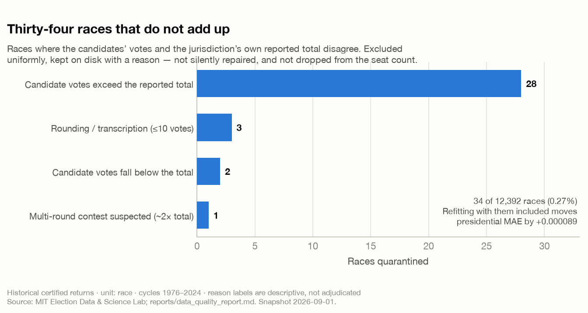

# Thirty-Four Races That Do Not Add Up

*Every exclusion rule is a lever with a direction. This is about building one I could not lean on.*

**Savepoint Analytics · US Election Analysis · historical certified returns, snapshot 2026-09-01**

---

## The question

I ingested fifty years of certified U.S. federal election returns: 12,392 races — president, House and Senate, 1976 through 2024, all fifty states plus D.C.

Then I ran the check that any ledger deserves. For each race, add up what the candidates got. Compare it to the total the jurisdiction reported. They should match.

Thirty-four of them do not. The 12,358 races that survive the check hold 40,502 candidate rows and reconcile to within half a percent, every one.

Thirty-four is 0.27% of the corpus, which is either a rounding error or the most interesting thing in the dataset, depending entirely on what you do next. This post is about what I did next, because the decision turns out to be a statistical one dressed as a janitorial one.

## Why a mismatch is not a bug report

The instinct is to fix it. You look at the 28 races where the candidate votes *exceed* the reported total, and you think: obviously the total is stale, use the sum. You look at the two where the candidates fall *below* the total, and you think: obviously there are write-ins or a minor candidate the source dropped, use the total. You look at the one where the candidate sum is almost exactly double the reported total and you think: ah, that is a runoff, or a jungle primary, two rounds stacked into one row.

Every one of those inferences is plausible. Not one of them is *knowable* from the discrepancy. The only thing that can tell you why a 1988 House race in some county does not reconcile is that state's certified return, and I do not have it. I have a secondary source that has already made its own reconciliation decisions, and the mismatch is the visible residue of a process I cannot see.

This is where the danger starts, and it has nothing to do with data cleaning.

**Cause-specific repair rules are researcher degrees of freedom with a hard hat on.** Four different repair rules for four different-looking failures, each individually defensible, applied by the same person who has seen the downstream results and has a rough sense of which way each fix will move them. That is not data engineering. That is a specification search conducted in a directory called `utils/`.

The identical pathology runs through experiment analysis, where it does far more damage because it is far more normalised. Bot filtering. Outlier trimming. "We excluded one enterprise account whose usage was anomalous." Dropping the first day of the test because instrumentation was flaky. Every one of these is sometimes correct and *all* of them are levers, and the tell is always the same: the filter is chosen after the analyst has seen what the filter does to the result.

If you want p-hacking, that is how you get p-hacking.

## The rule I built instead

One rule, applied uniformly, with no reference to cause:

> If a race's candidate votes do not reconcile with its reported total within a 0.5% tolerance, the race is **quarantined** — excluded from the modelling layer, written to disk with a descriptive reason label, and never silently repaired.

| Reason label | Races |
|---|---:|
| Candidate votes exceed the reported total | 28 |
| Rounding or transcription (≤10 votes) | 3 |
| Candidate votes fall below the total | 2 |
| Multi-round contest suspected (~2× total) | 1 |
| **Total** | **34** |

Three properties of this rule are doing the work, and the third is the one people skip.

**It is blind to cause.** The reason labels exist so a human can investigate later. They are *descriptive*, not adjudicated, and the documentation says so explicitly. No label changes what happens to the row. A label that changed behaviour would be a repair rule wearing a disguise.

**The excluded rows are retained, not deleted.** They live at `data/silver/quarantined_races.csv` with their reasons attached. An exclusion you cannot audit is indistinguishable from a result you cannot reproduce.

**The exclusion is tested for effect.** This is the part that converts a judgement call into evidence.

## Testing your own thumb for weight

If dropping 34 races changes the answer, then those races carry signal and the exclusion is doing hidden work — and I would need to either justify it far more carefully or not do it. If dropping them changes nothing, the exclusion is genuinely janitorial.

So I refit the presidential baseline both ways:

| Presidential baseline | MAE | n |
|---|---:|---:|
| Excluding quarantined races (published) | 0.036686 | 610 |
| Including quarantined races | 0.036775 | 612 |
| **Difference** | **+0.000089** | +2 |

Eighty-nine millionths of a point of two-party vote share. The exclusion is not carrying the result.

Now the caveat I owe you, because it substantially limits what that table proves: **only two of the 34 quarantined races are presidential state-cycles.** The other 32 are House and Senate rows. So this sensitivity test is a strong statement about the presidential model and a much weaker one about the stack as a whole. The right version runs the same comparison for the House and Senate models, where the affected row count is an order of magnitude higher. I have not built it. It is the obvious next thing and I am flagging it here rather than letting the reassuring table stand unqualified.

A sensitivity analysis you only run where you expect it to come back clean is not a sensitivity analysis. It is a character reference.

## The other decisions, published in full

Quarantine is the dramatic exclusion. The quiet ones move more data, so the pipeline reports every transform that dropped or merged a row, per source:

| Source | Non-general dropped | Vote-mode rows collapsed | Fusion candidates merged | Rows retained |
|---|---:|---:|---:|---:|
| President | 0 | 0 | 42 | 4,775 |
| U.S. House | 60 | 107 | 1,134 | 32,148 |
| U.S. Senate | 9 | 129 | 41 | 3,749 |

Primaries and other non-general stages are excluded so comparisons stay like-for-like. Fusion-voting lines — where New York lets one candidate appear on several party lines — are summed per candidate, so a candidate's own vote is not split across their party lines and then read as two weaker candidates.

That fusion number is the one I would draw your eye to. One thousand one hundred and thirty-four merges in the House file: thirty times the quarantine, quietly reshaping the party composition of thousands of races. Nobody ever writes a blog post about a merge rule. The exclusions get the scrutiny because they feel like a loss, and the transforms get none because they feel like tidying. The transforms are almost always bigger.

Two more flags that ride along on every race rather than removing it: **687 uncontested races (5.6%)**, which are excluded from model fitting — a candidate running unopposed measures ballot access, not district preference — but keep their seats in the chamber simulation. And **25 races flagged uncertified**. Flagged, not dropped, and never presented as certified. Unofficial totals, calls, estimates and certified results are four different things, and a pipeline that lets them share a column will eventually let them share a headline.

## What I would change

- **Run the sensitivity test for House and Senate.** Where 32 of the 34 rows actually live. Stated above; repeated here because it is the real gap in this post.
- **Resolve the multi-round race.** A candidate sum at roughly twice the reported total is very probably a Louisiana jungle primary or a runoff folded into one row. Probably is not a finding. One certified return settles it.
- **Vary the tolerance.** The 0.5% threshold is a choice. A curve of quarantine count against tolerance would show whether 34 is a stable population or an artefact of where I happened to put the line — and that curve takes about twenty minutes to produce.
- **Chase the 28 upward mismatches to source.** If they share a state or an era, that is a source-systematic problem worth reporting back rather than quarantining around.

## The broader lesson

In every story about an enterprise with two sets of books — Nucky's ledgers, Gus Fring's accountants, any organisation where the money must balance — the discrepancy is never self-explanatory. A number that does not reconcile is either an error or a story, and the gap itself cannot tell you which. What it *can* tell you is that somebody, at some point, has to decide. The interesting question is always whether that person has skin in which answer comes back.

The whole of data quality is that observation. You will have rows that do not add up. You cannot investigate them all. So you will build a rule, and the rule will have a direction, and the only real safeguard is to fix the rule before you can see which way it points — and then to publish what it cost.

Thirty-four races. Eighty-nine millionths of a point. Retained on disk, reasons attached, with a note saying which part of that claim I have actually earned.

---

*Figure generated by [`blog/figures/make_figures.py`](../figures/make_figures.py) from `reports/data_quality_report.md`, the committed output of the build. Data: [MIT Election Data and Science Lab](https://electionlab.mit.edu/) certified federal returns 1976–2024. Reason labels are descriptive; confirming why any given race fails reconciliation requires that state's certified return, not an inference from the discrepancy. Historical data only — no live forecast is published.*
