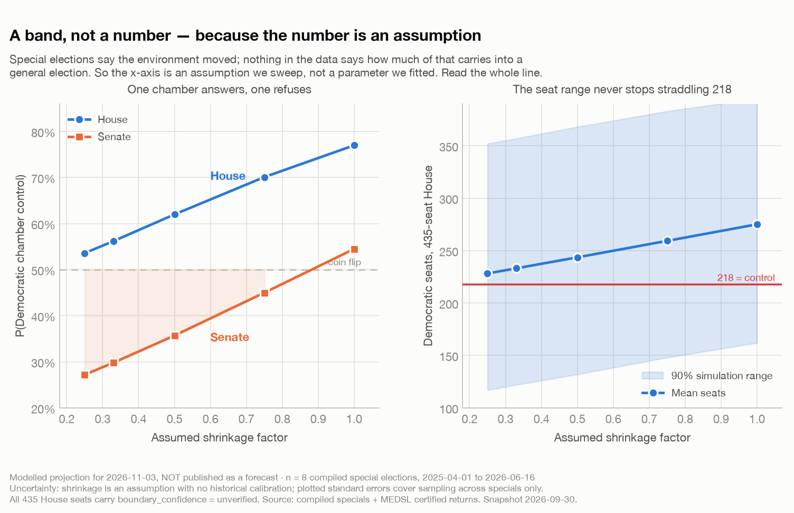

# The Forecast I Am Not Publishing

*The model runs. It produces a number. The number is wrong in a way I can describe precisely, which is the only reason I get to say so.*

**Savepoint Analytics · US Election Analysis · modelled projection, withheld · snapshot 2026-09-15**

---

## The question

By mid-September I had all the parts. Fifty years of certified returns, ingested and validated. Three calibrated baselines that beat naive persistence. A correlated simulation layer. A 2026 race universe — 435 House seats and 33 Senate seats, with current holders derived from returns. A national-environment estimator. Campaign finance filings joined in.

I ran the projection. It completed in seconds, wrote a report, and told me who was going to win the House.

I am not going to publish that number as a forecast, and this post is my attempt to explain why in enough detail that you could check my reasoning and disagree with it.

## Why an election forecast is harder to observe than it looks

The seductive thing about a district-level model is that it appears to be forecasting *a place*. TX-35 voted this way in 2024; here is the national environment; therefore TX-35 will vote that way in 2026.

But the model is not forecasting a place. It is forecasting *a row keyed to a district number*, and a district number is not a place. It is a label attached to a piece of territory by a legislature, and legislatures move it.

This is the part of *Altered Carbon* that always seemed to me more useful as an analytical idea than as science fiction. A person's stack gets moved into a new sleeve. The identity persists, the body is entirely different, and everyone who knew them has to decide how much of what they knew still applies. A redrawn congressional district is a resleeved district. The number is continuous. The territory is not. And every historical lag in my model — the district's previous result, its partisan lean, its incumbent's performance — is attached to the number.

My code, until very recently, assumed one congressional map per decade. That is true most of the time. It is not true now.

## What the projection actually says about itself

Here is the output, and the first thing worth noticing is what it says in its own footer:

```
house seats projected: 435/435   senate seats up: 33
district boundaries: {'unverified': 435}
projected by source: {'model_unverified': 435}
```

Every single House seat carries `boundary_confidence = "unverified"`. Not "unchanged" — *unverified*. The model is explicitly recording that it does not know whether the territory behind each district number is the same territory that produced the result it is projecting from.

That flag exists because of a design decision I want to dwell on, since it is the only reason this post can be written. The projection function **routes on boundary confidence**. Seats marked `unchanged` go to the model. Seats marked `redrawn` without a vote transfer are thrown off the model entirely — they do not get to keep their old-number prior, because that prior describes someone else's territory now — and fall back to a state-lean estimate with an inflated sigma, computed as `hypot(residual_sigma, β_lean × within-state lean sd)`, both inputs measured rather than assumed. And seats marked `unverified` **raise an exception** unless the caller explicitly passes `allow_unverified`.

The default behaviour of my own forecasting pipeline, when asked to project a seat whose boundaries it cannot vouch for, is to refuse and crash.

I had to opt in to get the number above. That is the correct relationship between an analyst and a model.

## How much of the chamber is affected

This is the one part of the post where I can give you a hard number, and it took a few hours of reading state government websites to earn it.

I compiled a plan-version register — which states, per state, which congressional plan is actually in effect for which cycles, with a source for every claim — and then verified every row against an official state or court record. **Nine states use a different congressional map in November 2026 than they used in 2024: Alabama, California, Florida, Louisiana, North Carolina, Ohio, Tennessee, Texas and Utah — 173 of 435 seats, 39.8% of the chamber.**

So: two fifths of the House is currently being projected from results that describe different territory. The register now knows that. The forecasting code does not — `plan_versions.py` is unwritten, nothing reads the CSV, and every seat is still flagged `unverified`. Having the fact and having the model consume the fact are separate pieces of work, and only the first one is done.

Verification was not a formality. It changed two rows in ways that reversed their meaning, and both corrections cut against the obvious move.

**Missouri enacted a new map and is not using it.** The 2025 plan is suspended pending a November referendum; the state supreme court ordered the 2022 map used for the general, a stay was denied, and the U.S. Supreme Court blocked the new map's use. The August primary ran on one map and the general reverts to another. So the naive correction — "Missouri redrew, therefore discard Missouri's prior" — is *wrong*. Missouri's 2024 prior is exactly right. A crude fix would have destroyed good data in eight districts.

**Alabama did not enact a new map — it restored an old one.** The draft recorded a fresh 2026 legislative enactment. What actually happened is that Alabama brought back the legislature's previously struck-down **2023** plan: reversion bills signed 2026-05-08, injunctions lifted by the Supreme Court on 2026-05-11, blocked again on 2026-05-26 by a three-judge panel as an intentional racial gerrymander under the Fourteenth Amendment and the Voting Rights Act, then cleared 6–3 on 2026-06-02 by an emergency stay. Alabama is still redrawn relative to 2024 — the 2023 legislative plan is not the Allen v. Milligan remedial map that 2024 was run on — but *which* map and *by what authority* were both wrong in the draft, and a register that records the wrong plan identity cannot support a vote transfer later.

And **Georgia, New York and Virginia did not redraw**, despite each being widely expected to: a legislature declined, a case was voluntarily dismissed, an amendment was struck down. Three states that a from-memory list would very likely have included.

I mention these because they are the reason the register had to be *researched* rather than *recalled*, and because they demonstrate the specific failure this whole exercise guards against: a correction applied with confidence and insufficient sourcing does not reduce error, it relocates it.

## The other two reasons

Boundaries are the largest problem. They are not the only one.

**The Senate band does not resolve.** As [the previous post](03-the-parameter-that-wasnt-there.md) lays out, the national environment is an unidentified band rather than an estimate, and Senate control sits inside it: P(Democratic control) runs from 27.2% to 54.5% across the swept assumption. It crosses the coin flip. There is no number in that range I could publish without the assumption doing the talking, and no defensible way to pick a point on it.



**The party crosswalk is two seats wrong, and it says so.** From the returns, the projection derives 67 Senate holdover seats not up in 2026, 32 of them Democratic-held, plus 13 currently-Democratic seats on the ballot — a derived caucus of 45 of 100.

The actual Democratic caucus is 47.

The report prints this, in the output, as a note: *"2 seats short of the actual Democratic caucus — unresolved party crosswalk."* It is a visible arithmetic error in a quantity that any reader could check in thirty seconds. The cause is known — deriving party from certified returns does not cleanly handle appointments, party switches and independents who caucus with a party — and it is an open backlog item.

Two seats out of a hundred, in a chamber whose control the band already could not resolve. Publishing a Senate probability on top of a Senate seat count I know to be wrong would be its own small scandal.

And underneath all three: the incumbency layer assumes **renomination for everybody**. 458 sitting members have a 2026 FEC filing; 10 were not found in the roster, and absence in that roster is not the same as retirement — it misses most departures. Primaries are not compiled at all. The model is projecting a chamber of candidates it has not confirmed are running.

## The assumptions doing the heavy lifting — in the decision, not the model

There is a version of this post where I have found a devastating flaw and heroically suppressed a bad number. That is not what happened, and I want to be accurate about the epistemics.

**The model is probably not badly wrong on the top line.** Most of the nine redrawn states redrew in ways that shift a handful of seats, and the correlated simulation's uncertainty is wide enough — the House 90% range spans 146 to 318 seats at the low end of the band — that a boundary error of this size is likely inside the interval. If I published, I would probably not be embarrassed.

"Probably not embarrassed" is not a standard. The problem is not that the number is likely wrong; it is that **I cannot state its error**, and a forecast whose error cannot be characterised is not a forecast, it is an opinion with a decimal point. The entire value proposition of this project is that every number traces to a source and carries a stated uncertainty. A House probability built on 173 seats the model still treats as unverified territory has an uncertainty term I have not measured and cannot bound.

**The second assumption is about what publication does.** A number in a report I can revise. A number on the internet with my name on it becomes a citation, gets screenshotted without its band, and outlives every caveat attached to it. In *The Boys*, Vought's entire business model is the distance between a measured quantity and the number that reaches the public, and the distance is created almost entirely by stripping context that was technically present in the source. I do not need a PR department to do that to my own work; a chart with a big number and a small footnote will do it unassisted.

## What I would change, in order

1. ~~**Verify the register.**~~ Done — every row confirmed against an official state or court record, which is what surfaced the Alabama and Missouri corrections above.
2. **Split litigation risk from boundary confidence.** Missouri broke the vocabulary. `boundary_confidence` should describe the relationship between this cycle's territory and last cycle's, given whichever plan is actually in effect. Whether litigation is live is a *separate* flag that the report prints and the routing ignores — otherwise a live case makes the model throw away a valid prior.
3. **Do not let the register move the backtest.** Alabama, Louisiana and North Carolina also changed maps between 2022 and 2024, so consulting the register for historical cycles would break those lags and shift every downstream number. That may well be more correct. It is also a model refit, and mixing a boundary correction into the same change as a refit makes it impossible to attribute which one moved the result. The register applies forward first; history is its own change, with its own before-and-after.
4. **Build the vote transfer and backtest it.** Allocate 2024 precinct results onto 2026 boundaries via census blocks, with three separate confidence components per district — unsplit share, old-district-majority share, ungeocoded share — that are never collapsed into a single score. Then backtest it on Virginia 2020→2022, where the answer is already known, against two comparators: no prior at all, and the state-lean fallback. The sigma for a transferred prior comes out of that backtest **measured**, not assumed. Until that number exists, a redrawn seat has no honest prior.

Only then does the House band get re-reported, with the redrawn-seat count and its treatment stated in the text.

## The broader lesson

The painted table at Dragonstone is a beautiful map of a kingdom that no longer looks like that. Everyone in the room plans against it anyway, because it is the map they have, and because the alternative is admitting they are planning against nothing.

Analytical systems have exactly this failure mode, and the pressure runs entirely one direction. There is always a deadline, always a stakeholder, always a perfectly good number sitting right there. "We can't measure this yet" is the least rewarded sentence in the discipline. Nobody was ever promoted for a null result, an inconclusive test, or a forecast withheld.

Which is precisely why the refusal has to be **engineered in advance**, before anyone knows which way the result points. Mine is a function that raises `UnverifiedBoundaryError` by default, a national-environment estimator that returns `status = "band"` and a required `shrinkage` argument with no default, a validator that will not let an unidentified quantity claim otherwise, and a report that prints its own boundary-confidence counts in the footer whether or not I want to read them. None of that was built in the moment of deciding. In the moment of deciding I wanted the number, like everybody does.

A model's most valuable output is occasionally a refusal. But refusals do not survive contact with a deadline unless they are load-bearing infrastructure — a raised exception, a required argument, a printed count — rather than a resolution.

So: the model produced a 2026 projection. It says Democrats are favoured for the House across every assumption in the band and that the Senate is unresolvable. It is not a forecast, it is not published as one, and the specific things that would have to be true before it could be are enumerated above, in order, with the first one being a few hours of somebody reading state government websites.

That is the least glamorous critical path I have ever written down, and it is the real one.

---

*Figure generated by [`blog/figures/make_figures.py`](../figures/make_figures.py) from `reports/national_environment_2026-09-15.json`, a committed output of a real build. Projection output: `reports/projection_2026.txt`. **The plan-version register described here was verified row-by-row against official state and court records on 2026-09-30, but no code in the forecasting stack reads it yet** — the projection still flags all 435 seats `unverified`, which is the subject of this post. Data: [MIT Election Data and Science Lab](https://electionlab.mit.edu/) certified federal returns 1976–2024; Federal Election Commission filings (aggregate use only); compiled special elections with per-row sourcing. This project is nonpartisan, models probability and uncertainty rather than preferred outcomes, and treats redistricting as an audit question — never a map-drawing one.*
