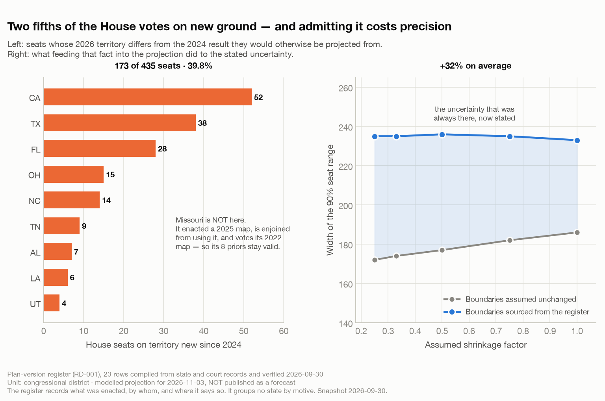

# The Map Is Not the Territory, and Neither Is the District Number

*Nine states vote on new ground in November. One enacted a map it is not allowed to use. One brought back a map that had been struck down. Three were expected to redraw and didn't. None of that was knowable from memory — which turned out to be the point.*

**Savepoint Analytics · US Election Analysis · plan-version register verified 2026-09-30**

---

## The question

My forecasting model projects each congressional district from its own previous result. TX-35 voted a certain way in 2024; here's the national environment; therefore TX-35 will vote roughly this way in 2026.

That inference contains a hidden premise: **that TX-35 is the same place it was.**

Most of the time it is. Congressional maps are redrawn after each decennial census — 1972, 1982, and so on to 2022 — and otherwise left alone. My code encoded exactly that: a function taking a year and returning which decade's map applies. One map per decade, fifty states at a time.

For this cycle, that function is wrong, and I needed to know by how much.

## Why "which map?" is harder to answer than it sounds

If you play Tigris and Euphrates, you know the moment when someone drops a single tile between two kingdoms and the entire board reorganises — holdings that were safe are suddenly contested, leaders who ruled a region are now minor partners in a bigger one, and the tokens haven't moved an inch. Nothing you own has changed. What you own it *in* has.

A redistricting cycle is that tile. The district number persists. The incumbent persists. The historical result sitting in my database under that number persists. The territory underneath it does not, and nothing in the data announces this.

So the question "which states use a different map in 2026 than in 2024?" has to be answered from outside the data. And it is not answerable from memory, for a reason I want to be precise about rather than modest: **the second wave of 2026 redraws followed a Supreme Court decision — *Louisiana v. Callais*, decided 2026-04-29, narrowing Section 2 of the Voting Rights Act.** Alabama, Florida, Louisiana and Tennessee all enacted new maps within about five weeks of it. Anything that learned about American redistricting before that date would confidently produce a list that omits them.

This is a general hazard, not a quirk. A model's training data has an edge, and the world keeps going past it. The only defence is to treat "what do I remember about this?" as a hypothesis and go look.

## The approach: a register, not a function

The fix is unglamorous. Replace the year function with a table.

One row per plan per state: which plan, which cycles it governed, who enacted it, when, its current status — and, crucially, **a `source_url` and a `retrieved_on` for every single claim**. States where nothing changed need no row and fall back to the decennial default, which keeps the table at 23 rows rather than fifty.

Two columns do the real work and the distinction between them cost me a design argument:

- **`boundary_confidence`** answers only *is this cycle's territory last cycle's territory?* It takes three values: `unchanged`, `redrawn`, `unverified`.
- **`litigation_risk`** answers *could a court still move this before election day?* It takes `none` or `active`.

An earlier version of the vocabulary merged these into one field with a `pending` value, routed the same as `redrawn`. That seemed obviously right and was obviously wrong, for reasons Missouri is about to explain.

## Where reality became inconvenient

Verification changed two rows in ways that reversed their meaning. Both corrections cut *against* the intuitive move, which is the part I find instructive.

**Missouri enacted a new map and is not using it.** The legislature passed one in September 2025. It was then suspended pending a referendum; the Missouri Supreme Court ordered the 2022 map used for the general; Justice Kavanaugh denied a stay; the U.S. Supreme Court blocked the new map's use. The August 2026 primary ran under the 2025 map. The November general reverts to 2022.

So the obvious correction — *Missouri redrew, therefore discard Missouri's priors* — is **wrong**. Missouri's territory is unchanged from 2024 and its eight district priors are exactly right. Had I routed on litigation rather than territory, a live court case would have made my model throw away eight perfectly good predictions. That is the entire argument for splitting the two columns, and I only found it because a real state refused to fit the vocabulary.

**Alabama did not enact a new map — it restored an old one.** My first draft recorded a fresh 2026 legislative enactment. What actually happened: reversion bills signed 2026-05-08 allowing the state to go back to previously struck-down maps after *Callais*; injunctions lifted by the Supreme Court on 2026-05-11; blocked again on 2026-05-26 by a three-judge federal panel, which found the plan an intentional racial gerrymander under the Fourteenth Amendment and the Voting Rights Act; then cleared 6–3 on 2026-06-02 by an emergency stay.

Alabama is still *redrawn* relative to 2024 — the restored 2023 legislative plan is not the court-ordered remedial map that 2024 actually ran on. But *which* plan and *by what authority* were both wrong in my draft, and a register that names the wrong plan cannot support the vote-transfer work that comes next. Getting the direction right is not the same as getting the row right.

**And three states that everyone expected to redraw didn't.** Georgia's legislature declined the governor's special session. New York's litigation was voluntarily dismissed, leaving the 2024 map. Virginia's amendment passed in April and was struck down by the state Supreme Court in May. A from-memory list would very likely have included all three.

One more worth stating because it cuts the other way: **Ohio's new plan is not a mid-decade partisan redraw at all.** It is the constitutionally required successor to a four-year plan, adopted unanimously by its commission after the General Assembly missed a deadline. The register records the authority and the date. It does not group states by motive, and neither will I — whether any particular map is an outlier is a different question, answered against simulated ensembles, and this project treats that as an audit exercise rather than an accusation.

## What the register says

**Nine states use a different congressional map in November 2026 than they used in 2024: Alabama, California, Florida, Louisiana, North Carolina, Ohio, Tennessee, Texas and Utah — 173 of 435 seats, 39.8% of the chamber.**

Every one of those 173 seats was, until this landed, being projected from a 2024 result describing different ground.

## What correcting it cost

Here is the part I did not expect to be writing, and the reason this post exists rather than a victory lap.

Feeding sourced boundaries into the model made the forecast **worse**, in the specific sense that matters most to anyone who wants a headline.

A redrawn seat with no prior on its new territory cannot use its old number's result. It falls back to its state's presidential lean with a wider sigma — 0.145 against 0.112 for a modelled seat. Do that for 173 seats and the chamber forecast loosens considerably:

| | Assumed boundaries | Sourced boundaries |
|---|---:|---:|
| Mean width of the 90% seat range | 178 seats | **235 seats** |
| 90% range at the low end of the band | 146–318 | **117–352** |
| Seats fitted by the model | 391 | **367** |

The register also applies to history — Alabama, Louisiana and North Carolina each changed maps between 2022 and 2024 as well — which cost 27 district-cycles their lag and dropped the model's seat coverage from 89.9% to 84.4%.

Accuracy itself barely moved: House mean absolute error went from 0.078782 to 0.078694, a hair *better*, because the lags that got removed were comparisons across different territory and therefore noise. But the honest interval got a third wider.

**That is what a real correction usually looks like.** It did not reveal a hidden signal. It revealed that a chunk of my apparent precision was an artefact of not knowing something. The uncertainty was always there. The register just made me write it down.

One result genuinely surprised me: the House *control probability* band **narrowed** — from 51.8–79.2% to 53.6–77.0% — while the seat range widened by a third. Wider per-seat uncertainty drags extreme probabilities toward a coin flip from both directions. Seat-count precision and probability precision are different quantities and do not have to move together, which is worth knowing before anyone reads a tightening probability as a firming forecast.

## The assumptions still doing heavy lifting

- **`status` means standing today; the cycle range means which elections a plan actually governed.** A plan superseded in 2026 still ran the 2022 election. Conflating the two put Missouri briefly in a state where no map governed 2026 at all — the validator's first test now checks exactly that.
- **The decennial fallback is still an assumption.** A state with no register row is assumed not to have redrawn. The register is only as complete as its compilation.
- **The decennial fallback still assumes absence of evidence is evidence of absence.** A state with no register row is assumed not to have redrawn. The register is only as complete as its compilation.

## The same mistake, one level down

I filled in `litigation_risk` by reading each row's own verified notes. Then I went and checked it against the case trackers, state by state, expecting to confirm a handful of details.

**It was wrong in five of nine states, every time in the same direction.** California, Florida, North Carolina, Texas and Utah all had pending cases. My register said `none` for all five.

The cause is the thing this whole post is about, wearing a smaller hat. Those notes said things like *"the US Supreme Court denied an injunction"* for California and *"a federal panel declined to block it"* for North Carolina. Both statements are true, and both were written to establish **which map is in effect** — which is what I needed them for at the time. Neither says anything about **whether the case is over**. A denied preliminary injunction means the map stands *while the merits carry on*.

So I had built a column to separate "did the territory move?" from "could a court move it?", precisely because conflating those two gets Missouri backwards — and then populated the second column by misreading evidence about the first. The distinction I had just spent a design argument defending, I failed to apply inside the field created to hold it.

Nine of the ten states in the register have live litigation. Only Ohio does not.

The correction moved **no projected number at all** — the band is bit-identical before and after, because the routing never consults litigation. Five states changed status and not one seat changed prior. That is the split doing exactly its job, and it is also the reason the error was survivable: a column that nothing routes on can be wrong for a fortnight without corrupting a forecast. Had I wired litigation into the routing, as the original `pending` vocabulary did, those five states would have thrown away 115 seats' worth of perfectly good priors.

One more honesty note: the new values are sourced to a case tracker, not a court docket, and the register's own standard is an official state or court record. So they carry `researched_secondary` rather than `verified`, with a URL and a retrieval date on every row. Better than my inference. Still not the bar.

## What I would do next

**Fill in the block-assignment files.** The `baf_url` column is empty on all 23 rows. Those files map census blocks to districts, and they are what allows a 2024 precinct result to be placed onto 2026 boundaries — which is the only thing that gives those 173 seats real priors instead of a state average. Census publishes them for plans it has ingested, which lags mid-decade redraws, so several of these states will need a legislature- or court-published file instead.

**Then measure the transfer rather than trusting it.** Allocate old results onto new boundaries, backtest the method on Virginia 2020→2022 where the answer is already known, and take the uncertainty for a transferred prior from that backtest. Not from a plausible-sounding default.

**Take the litigation column to a docket.** It is researched now rather than guessed, but a tracker is not a court record, and this is the column that has already proven it can be wrong in one direction five times over.

## The broader lesson

There is a line in *The Sopranos* about territory that applies here better than it has any right to: everything in that world is an argument about whose ground is whose, conducted by people who all agree the ground itself hasn't moved. The maps in the back room are the whole business.

The lesson I actually take from this is narrower and more useful. **Being roughly right about a fact is not the same as having the fact.** I could have guessed "several states redrew, probably Texas and California and some others" and been *directionally* correct. I would have missed Missouri entirely, got Alabama's plan identity wrong in a way that breaks the next piece of work, and included three states that didn't redraw.

A directionally-correct guess and a sourced register produce the same headline and completely different downstream code.

And the second lesson, which took longer to accept: **a correction that widens your error bars is still a correction.** The temptation to leave the decennial function alone was real, and it had a respectable argument behind it — the old numbers were tighter, the model looked better, and nobody was going to check. Thirty-two percent more uncertainty is not a result anyone wants to publish.

It is, however, the amount of uncertainty that was there the whole time.

---

*Figure generated by [`blog/figures/make_figures.py`](../figures/make_figures.py) from `data/gold/race_universe_2026.parquet` and `reports/national_environment_2026-09-30.json`, both outputs of a real build. Register: `data/reference/house_plan_versions.csv`, 23 rows compiled from state and court records and verified 2026-09-30; verification notes at `docs/plan-version-worklist.md`. Data: [MIT Election Data and Science Lab](https://electionlab.mit.edu/) certified federal returns 1976–2024. The 2026 projection discussed here is a modelled sensitivity band and is **not published as a forecast** — see [the previous post](05-the-forecast-i-am-not-publishing.md). This project is nonpartisan: the register records what was enacted, by whom, and where it says so, and groups no state by motive. Redistricting is treated as an audit and record-keeping question; a simulated map can show consistency with an objective but never proves intent.*
